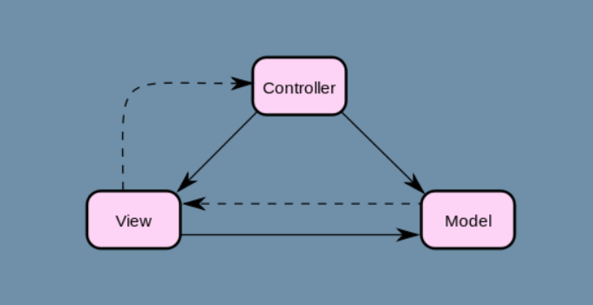

# Laporan Modul 1: Perkenalan Laravel

**Mata Kuliah:** Workshop Web Lanjut  
**Nama:** A'llieya Maysarah  
**NIM:** 2024573010047  
**Kelas:** TI/1B  

---

## Abstrak  
Laporan ini membahas mengenai pengenalan framework Laravel sebagai salah satu framework PHP yang banyak digunakan dalam pengembangan aplikasi web modern. Isi laporan mencakup teori dasar tentang Laravel, komponen utama yang mendukungnya, struktur folder proyek, serta penjelasan mengenai arsitektur MVC yang menjadi dasar kerjanya. Tujuan dari laporan ini adalah untuk memberikan pemahaman awal tentang konsep Laravel, sehingga dapat menjadi bekal dalam membangun aplikasi web yang terstruktur, efisien, dan mudah dikembangkan.  

---

## 1. Pendahuluan  

**Apa itu Laravel?**  
Laravel adalah framework PHP open-source yang digunakan untuk membangun aplikasi web. Framework ini membantu developer membuat aplikasi dengan lebih cepat, terstruktur, dan mudah dipelihara karena sudah menyediakan banyak fitur bawaan.  

**Karakteristik Utama Laravel**  
- Menggunakan arsitektur **Model-View-Controller (MVC)** untuk memisahkan logika, data, dan tampilan.  
- Termasuk **opinionated framework**, yaitu sudah memiliki aturan dan standar bawaan agar pengembangan lebih konsisten.  
- Memiliki banyak fitur bawaan seperti **Eloquent ORM**, **Blade template engine**, **Artisan CLI**, serta sistem **migrasi database**.  
- Mendukung keamanan aplikasi dengan proteksi **CSRF, validasi input, dan autentikasi**.  

**Jenis Aplikasi yang Cocok**  
Laravel cocok digunakan untuk berbagai macam aplikasi web, antara lain:  
- Aplikasi sederhana seperti blog atau sistem informasi dasar.  
- Website e-commerce atau toko online.  
- Aplikasi perusahaan seperti sistem informasi manajemen.  
- API berbasis RESTful untuk kebutuhan aplikasi mobile maupun web modern.  

---

## 2. Komponen Utama Laravel (ringkas)  

- **Blade (templating)**  
  Blade adalah template engine bawaan Laravel yang digunakan untuk memisahkan tampilan dengan logika aplikasi. Dengan Blade, kita bisa membuat layout yang dinamis menggunakan sintaks sederhana.  

- **Eloquent (ORM)**  
  Eloquent adalah Object Relational Mapping (ORM) Laravel yang mempermudah interaksi dengan database. Dengan Eloquent, kita bisa mengelola data menggunakan model tanpa menulis query SQL secara manual.  

- **Routing**  
  Routing digunakan untuk menentukan ke mana sebuah URL diarahkan dalam aplikasi. Laravel menyediakan sistem routing yang fleksibel untuk menghubungkan URL dengan fungsi, controller, atau view tertentu.  

- **Controllers**  
  Controller bertugas sebagai penghubung antara model dan view. Semua logika aplikasi biasanya diletakkan di dalam controller agar kode lebih rapi dan terorganisir.  

- **Migrations & Seeders**  
  Migration digunakan untuk membuat dan memodifikasi struktur tabel pada database. Seeder digunakan untuk mengisi data awal ke dalam tabel sehingga mempermudah proses uji coba aplikasi.  

- **Artisan CLI**  
  Artisan adalah Command Line Interface bawaan Laravel yang menyediakan banyak perintah otomatis, seperti membuat controller, model, migration, hingga menjalankan server lokal.  

- **Testing (PHPUnit)**  
  Laravel sudah terintegrasi dengan PHPUnit untuk melakukan pengujian otomatis. Fitur ini memastikan aplikasi berjalan sesuai harapan dan membantu menjaga kualitas kode.  

---

## 3. Struktur Folder Proyek Laravel  

Berikut adalah penjelasan dari folder dan file utama dalam sebuah project Laravel:  

- **app**  
  Berisi kode utama aplikasi, termasuk model, controller, dan middleware. Di sinilah logika bisnis aplikasi biasanya ditulis.  

- **bootstrap**  
  Berisi file yang menginisialisasi framework dan mengatur autoloading. Folder ini juga menyimpan cache untuk mempercepat performa aplikasi.  

- **config**  
  Berisi file konfigurasi untuk aplikasi seperti database, cache, mail, session, dan layanan lainnya.  

- **database**  
  Menyimpan file migration, seeder, dan factory. Migration digunakan untuk membuat atau mengubah tabel, seeder untuk mengisi data awal, dan factory untuk membuat data dummy.  

- **public**  
  Folder yang berisi file yang dapat diakses oleh pengguna, seperti `index.php`, file CSS, JavaScript, dan gambar. Semua request aplikasi akan masuk melalui file `index.php` di sini.  

- **resources**  
  Menyimpan file view (Blade template), file bahasa (localization), serta asset mentah seperti CSS dan JavaScript sebelum dikompilasi.  

- **routes**  
  Berisi definisi routing aplikasi, seperti `web.php` untuk route berbasis web, `api.php` untuk route berbasis API, `console.php` untuk perintah Artisan, dan `channels.php` untuk broadcasting.  

- **storage**  
  Menyimpan file yang dihasilkan aplikasi, seperti log, cache, session, dan file yang di-upload pengguna. Folder ini juga berisi `app`, `framework`, dan `logs`.  

- **tests**  
  Berisi file pengujian otomatis menggunakan PHPUnit. Terdapat dua folder utama: `Feature` untuk pengujian tingkat fitur, dan `Unit` untuk pengujian fungsi kecil.  

- **vendor**  
  Menyimpan semua package dan dependensi yang diinstal melalui Composer. Folder ini dikelola otomatis dan biasanya tidak diubah secara manual.  

- **.env**  
  File konfigurasi environment yang berisi pengaturan seperti database, mail server, API key, dan konfigurasi lain yang berbeda untuk tiap environment (local, staging, production).  

- **artisan**  
  File PHP untuk menjalankan perintah Artisan CLI.  

- **composer.json**  
  File konfigurasi Composer yang mencatat package atau dependensi yang digunakan oleh proyek Laravel.  

---

## 4. Diagram MVC dan Cara Kerjanya  

Arsitektur MVC (Model–View–Controller) pada Laravel bekerja dengan cara memisahkan antara data, logika bisnis, dan tampilan aplikasi.  

- **Model** → Mengatur interaksi dengan database (CRUD data).  
- **View** → Bertugas menampilkan data ke pengguna melalui antarmuka.  
- **Controller** → Menjadi penghubung antara model dan view; menerima request dari user, memproses logika, lalu mengirimkan hasil ke view.  

Alur kerjanya:  
1. User mengirim request melalui browser.  
2. Request diterima oleh **Route** dan diteruskan ke **Controller**.  
3. Controller memanggil **Model** untuk mengakses atau memanipulasi data di database.  
4. Data dari Model dikirim kembali ke Controller.  
5. Controller meneruskan data ke **View**.  
6. View menampilkan data ke browser user.  

Gambar diagram MVC:  

  

---

## 6. Kelebihan & Kekurangan (Refleksi Singkat)  

**Kelebihan :**  
- Struktur aplikasi lebih rapi karena menggunakan pola **MVC**.  
- Memiliki banyak fitur bawaan (routing, ORM, templating, autentikasi).  
- Dokumentasi lengkap dan komunitas yang besar sehingga mudah mencari solusi.  
- Mendukung keamanan aplikasi (CSRF protection, enkripsi password, validasi input).  

**Kekurangan :**  
- Membutuhkan resource server lebih besar dibanding framework ringan.  
- Banyaknya fitur bisa terasa membingungkan di awal belajar.  
- Proses instalasi dan konfigurasi awal (Composer, PHP, Node.js) kadang cukup rumit untuk pemula.  

---

## 7. Referensi  

1. Laravel Documentation — https://laravel.com/docs  
2. Petani Kode. *Apa itu Laravel?* — https://www.petanikode.com/laravel-pengertian  
3. Widada, W. *Belajar Laravel untuk Pemula*, Deepublish, 2022.  
