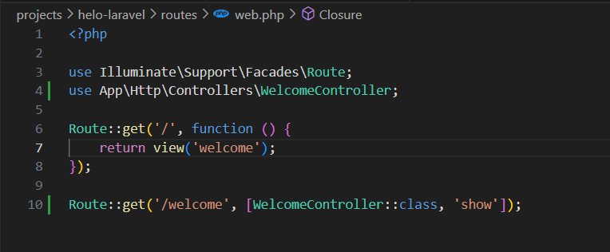
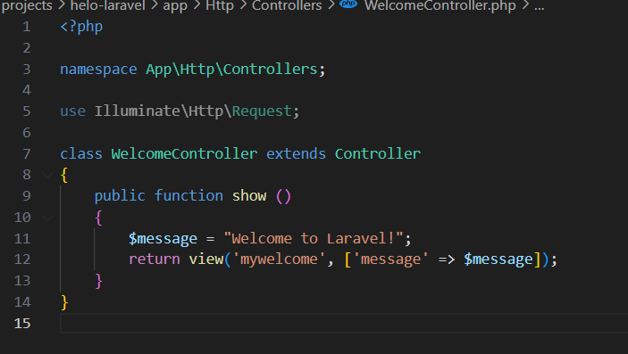
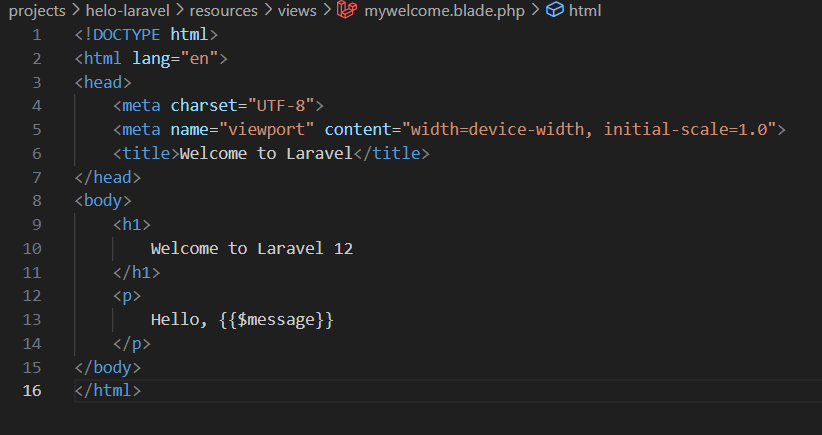
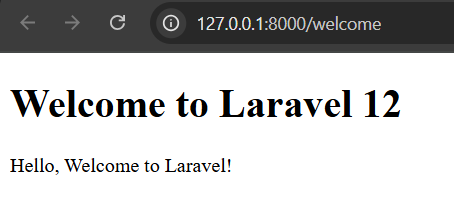
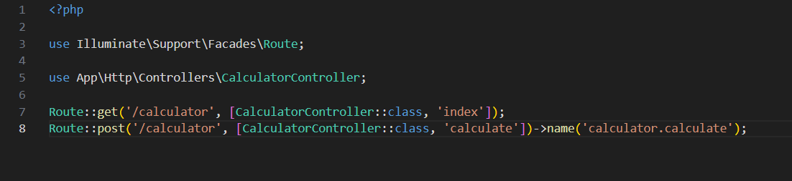
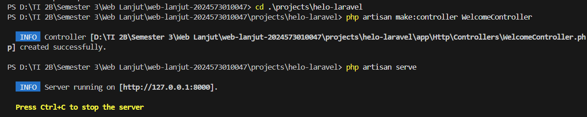
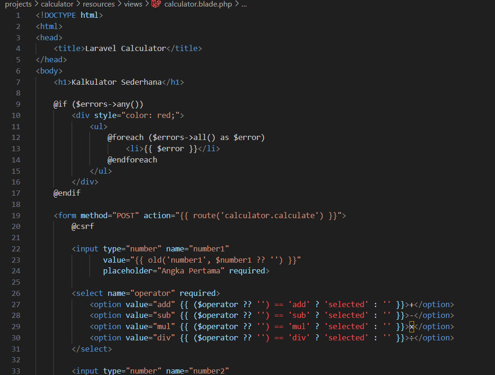
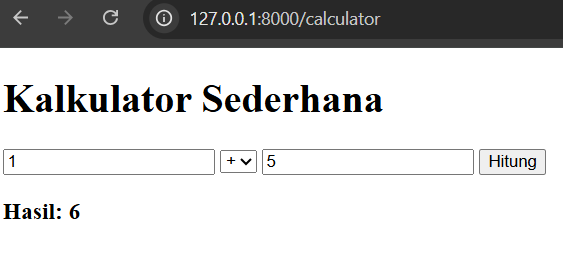

# Laporan Modul 2: Laravel Fundamentals
**Mata Kuliah:** Workshop Web Lanjut  
**Nama:** A'llieya Maysarah  
**NIM:** 2024573010047  
**Kelas:** TI/2B  

---

## Abstrak 
Laporan ini membahas dasar penggunaan framework Laravel khususnya mengenai konsep **MVC (Model-View-Controller)**, **Routing**, **Middleware**, serta cara Laravel menangani request dan response. Praktikum ini terdiri dari dua bagian yaitu membuat route, controller, dan blade view sederhana, serta membangun aplikasi kalkulator menggunakan Laravel. Tujuan praktikum adalah agar mahasiswa memahami bagaimana alur kerja Laravel dalam membangun aplikasi web, serta mengimplementasikan konsep MVC dalam sebuah project sederhana.  

---

## 1. Dasar Teori
- **MVC (Model, View, Controller):** Pola arsitektur yang memisahkan aplikasi menjadi tiga komponen utama. Model untuk data, View untuk tampilan, Controller untuk logika.  
- **Routing:** Proses pemetaan URL ke fungsi atau controller tertentu.  
- **Middleware:** Lapisan penghubung yang memproses HTTP request sebelum mencapai controller.  
- **Request dan Response:** Laravel menerima request dari pengguna, meneruskannya ke route → controller → model, lalu mengembalikan response ke view.  
- **Controller dan View:** Controller mengolah logika, View menampilkan hasil ke user.  
- **Blade Templating Engine:** Template engine bawaan Laravel dengan sintaks sederhana seperti `@extends`, `@yield`, dan `@section`.  

---

## 2. Langkah-Langkah Praktikum  

### 2.1 Praktikum 1 – Route, Controller, dan Blade View  

   
  <em>Gambar 2.1. Route pada file web.php</em>

   
  <em>Gambar 2.2. Membuat WelcomeController</em>

   
  <em>Gambar 2.3. Tampilan view mywelcome.blade.php</em>

   
  <em>Gambar 2.4. Hasil tampilan Welcome di browser</em>

### 2.2 Praktikum 2 – Membuat Aplikasi Sederhana "Calculator"  

   
  <em>Gambar 2.5. Route untuk aplikasi kalkulator</em>

   
  <em>Gambar 2.6. Membuat CalculatorController</em>

   
  <em>Gambar 2.7. Tampilan view calculator.blade.php</em>

   
  <em>Gambar 2.8. Hasil aplikasi kalkulator dengan beberapa input</em>

---

## 3. Hasil dan Pembahasan

Dari praktikum yang udah dijalanin, aplikasinya bisa jalan sesuai yang diharapkan.  

- **Apakah aplikasi berjalan sesuai harapan?**  
  Iya, pas buka route `/welcome` langsung muncul halaman welcome. Kalkulator juga bisa dipakai buat tambah, kurang, kali, sama bagi.  

- **Apa yang terjadi jika ada input yang salah (misalnya pembagian dengan 0)?**  
  Kalau coba bagi dengan 0, hasilnya ga error blank, tapi muncul tulisan *"Error: Division by zero"* karena udah dicek di controllernya.  

- **Bagaimana validasi input bekerja di Laravel?**  
  Laravel punya fitur validasi bawaan lewat `$request->validate()`. Jadi kalau mau, kita bisa nambah aturan biar input dicek dulu (misalnya harus angka, ga boleh kosong, dsb) sebelum diproses.  

- **Apa peran masing-masing komponen (Route, Controller, View) dalam program yang dibuat?**  
  - **Route:** nyambungin URL yang diketik user ke fungsi di controller.  
  - **Controller:** ngurus logika, misalnya ngitung hasil kalkulator.  
  - **View:** nampilin hasil ke user dalam bentuk halaman web.  

---

## 4. Kesimpulan

Dari praktikum ini bisa disimpulin kalau Laravel emang ngebantu banget buat bikin aplikasi web lebih teratur karena pakai konsep MVC. Route ngarahin request, Controller ngurus logika, dan View nampilin hasil ke user.  

Di percobaan pertama, kita bisa bikin halaman welcome sederhana. Di percobaan kedua, kita berhasil bikin kalkulator yang bisa ngerjain operasi hitung dasar. Kalau ada input yang ga bener (kayak bagi 0), aplikasinya juga bisa ditangani biar ga error.  

Jadi, intinya Laravel bikin proses ngoding web lebih gampang, rapi, dan jelas alurnya.

---
## 5. Referensi

1. Laravel Documentation — https://laravel.com/docs  
2. Petani Kode, *Belajar Laravel Dasar* — https://www.petanikode.com/laravel  
3. Widada, W. *Belajar Laravel untuk Pemula*, Deepublish, 2022.  

